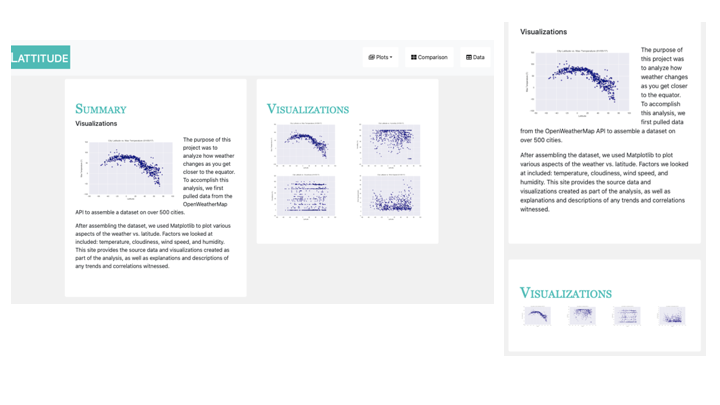
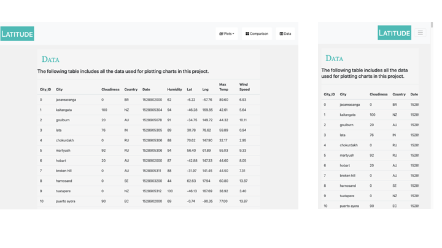
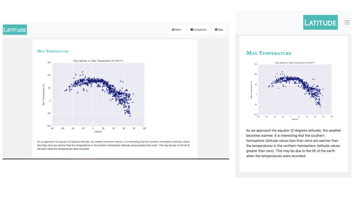
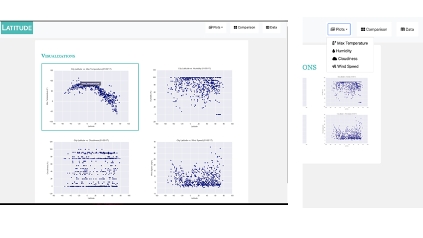

# Web Design Homework - Web Visualization Dashboard (Latitude)

## Background

This project using HTML and CSS to create a dashboard showcasing weather data analysis.

### In this Repository

1. Index.html - the landing page which links to all other html files

2. A folder called WebVisualizations which contains all **html**, **assets**, **Resources** and **visualizations**

3. **WebVisualizations** also holds the **BONUS** material. 
<a href = "https://annmcnamara.github.io/Web-Design-Challenge/WebVisualizations/Bonus">Click For Bonus Web Page</a>

4. This README.md

## Latitude - Latitude Analysis Dashboard with Attitude

This project consists of dashboard, individual pages for each plot and a means to navigate between them. Pagesw contain the visualizations and their corresponding explanations. The landing page holds comparison of all of the plots, and links to another page the data used to build them is displayed.

### Website 

For reference, see the ["Screenshots" section](#screenshots) below.

The website consists of 7 pages total, including:

* A [landing page](#landing-page) containing:
  * An explanation of the project.
  * Links to each visualizations page.
* Four [visualization pages](#visualization-pages), each with:
  * A descriptive title and heading tag.
  * The plot/visualization itself for the selected comparison.
  * A paragraph describing the plot and its significance.
* A ["Comparisons" page](#comparisons-page) that:
  * Contains all of the visualizations on the same page so we can easily visually compare them.
  * Uses a bootstrap grid for the visualizations.
    * The grid must be two visualizations across on screens medium and larger, and 1 across on extra-small and small screens.
* A ["Data" page](#data-page) that:
  * Displays a responsive table containing the data used in the visualizations.
    * The table is a bootstrap table component. [Reference](https://getbootstrap.com/docs/4.3/content/tables/#responsive-tables)
    * The data was the product of exporting the `.csv` file as HTML, or converting it to HTML using a pandas method called `to_html` that allows you to generate a HTML table from a pandas dataframe. [Reference](https://pandas.pydata.org/pandas-docs/version/0.17.0/generated/pandas.DataFrame.to_html.html)

At the the top of each page has a navigation menu that:

* Has the name of the site on the left of the nav which allows users to return to the landing page from any page.
* Contains a dropdown on the right of the navbar named "Plots" which provides links to each individual visualization page.
  * Note: https://fontawesome.com/ was used to include the icons 
* Provides two more links on the right: "Comparisons" which links to the comparisons page, and "Data" which links to the data page.
* Is responsive (using media queries). The nav must have behavior as the screenshots  ["Navigation Menu" section](#navigation-menu) (notice the background color change).

The website is be deployed to GitHub pages.

### Considerations

* This [weather data](WebVisualizations/Resources/cities.csv) was used for the requirements. 
* Bootstrap is used. This includes using the bootstrap `navbar` component for the header on every page, the bootstrap table component for the data page, and the bootstrap grid for responsiveness on the comparison page.
* The website is deployed to GitHub pages, with the website working on a live, publicly accessible URL as a result.
* Care was taken to ensure website works at all window widths/sizes.

### Bonuses

* Using a different dataset - from a previous project looking at National Parks Data - the requirements above still hold, but the look and feel are different.
* A bootstrap theme was used to customize the website.
* Icons were used in the drop down menu  
* Extra visualizations were included in the BONUS page

** The bonus <a href =  https://annmcnamara.github.io/Web-Design-Challenge/WebVisualizations/Bonus> web page is linked here </a>

### Screenshots

A selection of screenshots from the web pages. 

#### Landing page

#### Comparisons page

#### Data page

#### Visualization pages
There are four of these, one for each visualization. Here's an example of one:

#### Navigation menu

#### Navigation Dropdown with icons and Selection with Borders

### Copyright

Ann McNamara © 2020. All Rights Reserved.
